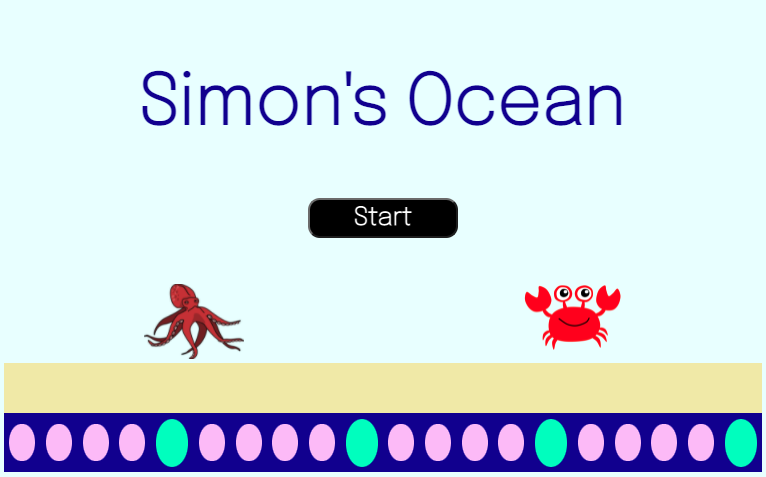
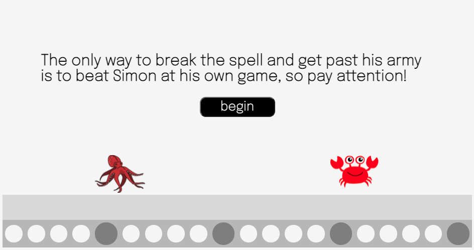
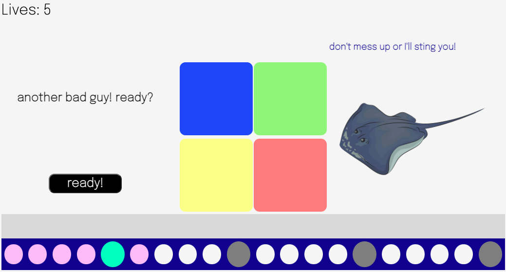
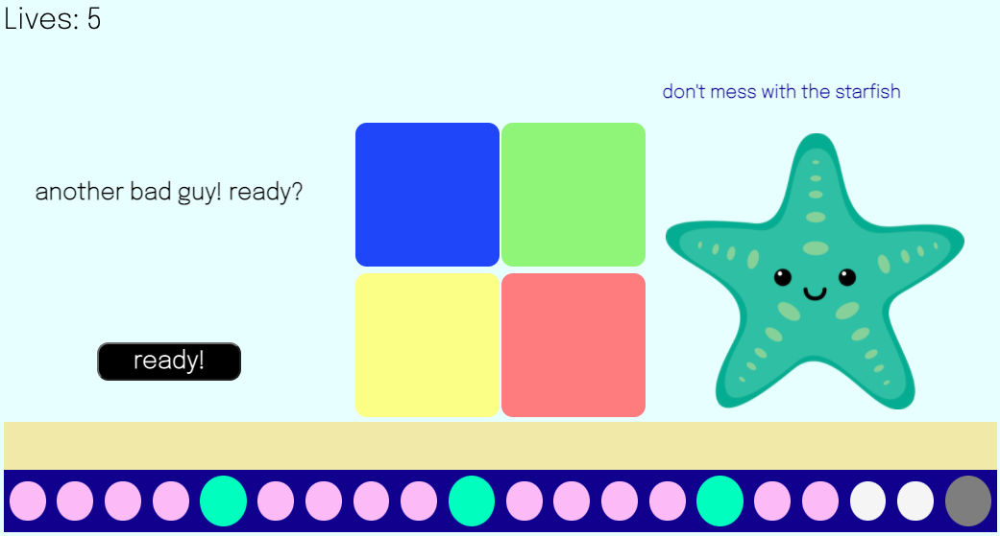
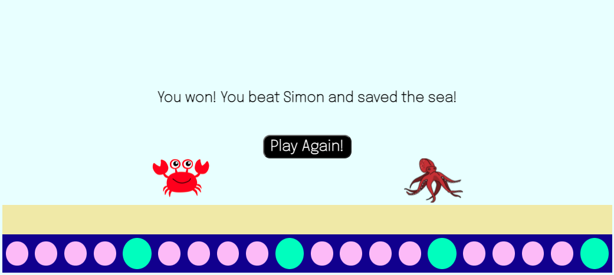
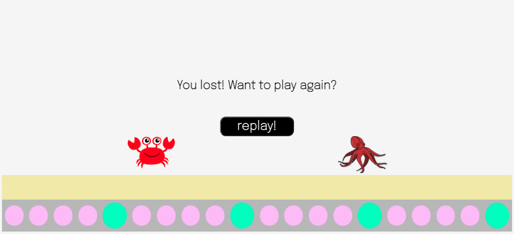

### Introduction
This game builds on the traditional game of Simon and includes levels, a world that changes as the game progresses, a revolving cast of opponents, and a randomly generated set of moves for each level.  

### Backstory
While you were on vacation, Simon hypnotized everyone in the sea into doing whatever he says. He didn't stop there - he hypnotized the sea itself into losing all of its color. Your best friend, Crabby McStabby, has gone missing. You must build a bridge across the reef to find Crabby! The only way to break the spell and get past Simon's army is to beat him at his own game, so pay attention!

---

### Screenshots

### Technologies Used
- JavaScript
- CSS
- HTML

### Getting Started
Play the game here: [Simon's Ocean](https://alliedelano.github.io/simons-ocean/)

### Game Play
Once you click "start," you'll learn the backstory and begin the game. From there, it's easy - all you have to do to beat each level is repeat the sequence your opponent displays on Simon! 

There are four colors: blue, green, red, and yellow. Your opponent's moves are randomly generated based on world and level and will "light up" in order. After they're done, it'll be your turn to repeat their sequence. If you're successful, you'll move on to the next level! If not, you'll lose a life and repeat the level, usually against a new opponent. If you lose all of your lives, you lose the game and have an opportunity to replay from the beginning. 

As you beat levels, you'll build a path across the screen. Every five levels, you'll complete a "world" and an element of the sea will regain its color: first the reef path at the bottom, then the sand, then the water itself. Once you fill in the entire path, you win the game! 

### Next Steps
- End battle against Simon himself
- Animation when an opponent loses
- Difficulty modes (easy, medium, difficult)
- Sounds
- Simplify JavaScript code
- Improve CSS for smaller screen sizes
